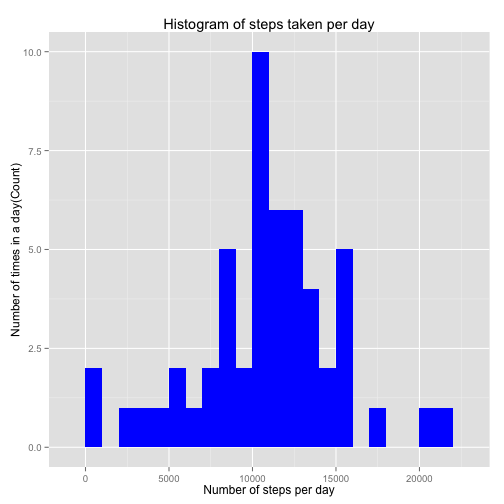
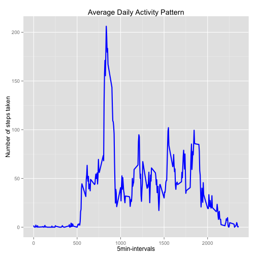
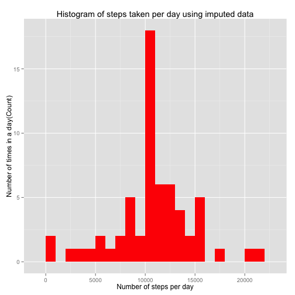
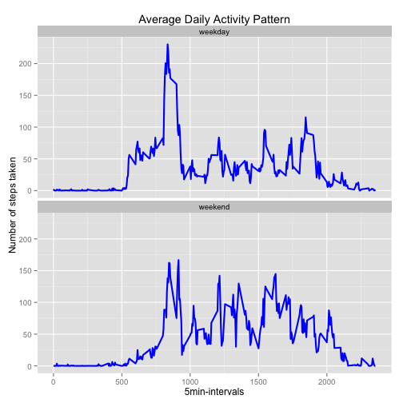

#Loading and preprocessing the data


**General settings and loading of required libraries**

```r
library(knitr)
library(ggplot2)
opts_chunk$set(echo = TRUE, results = 'hold')
```


**1. Load the data (i.e. read.csv())**

```r
    temp <- tempfile()
    fileURL <- "https://d396qusza40orc.cloudfront.net/repdata%2Fdata%2Factivity.zip"
    download.file(fileURL, method="curl", temp)
    con <- unzip(temp, "activity.csv")
    activity <- read.csv("activity.csv", na.strings ="NA")
    unlink(temp) 
```
**2. Process/transform the data (if necessary) into a format suitable for your analysis**

```r
activity$date <- as.Date(activity$date, format = "%Y-%m-%d")
activity$interval <- as.factor(activity$interval)
```

#What is mean total number of steps taken per day?
For this part of the assignment, you can ignore the missing values in the dataset.

```r
dailysteps <- aggregate(steps~date, activity, sum)
colnames <- c("steps", "date")
```


**1. Make a histogram of the total number of steps taken each day. This is done using package ggplot2, which was loaded earlier.**

```r
plot1 <- ggplot(dailysteps, aes(x = steps)) + 
    geom_histogram(fill = "blue", binwidth = 1000) + 
    labs(title="Histogram of steps taken per day", 
         x = "Number of steps per day", y = "Number of times in a day(Count)")
print(plot1)
```

 

**2. Calculate and report the mean and median total number of steps taken per day**

```r
mean(dailysteps$steps, na.rm=TRUE)
median(dailysteps$steps, na.rm=TRUE)
```

```
## [1] 10766.19
## [1] 10765
```


#What is the average daily activity pattern?


**1. Make a time series plot (i.e. type = "l") of the 5-minute interval (x-axis) and the average number of steps taken, averaged across all days (y-axis)**


```r
steps.interval  <- aggregate(activity$steps, list(interval = as.numeric(as.character(activity$interval))), na.rm=TRUE, FUN="mean")
colnames(steps.interval) <- c("interval", "steps")
str(steps.interval)

plot2 <- ggplot(steps.interval, aes(x=interval, y=steps)) + geom_line(color="blue", size=1) +  
                    labs(title="Average Daily Activity Pattern", x="5min-intervals", y="Number of steps taken")
print(plot2)
```

 

```
## 'data.frame':	288 obs. of  2 variables:
##  $ interval: num  0 5 10 15 20 25 30 35 40 45 ...
##  $ steps   : num  1.717 0.3396 0.1321 0.1509 0.0755 ...
```


**2. Which 5-minute interval, on average across all the days in the dataset, contains the maximum number of steps?**

```r
max.interval <- steps.interval[which.max(steps.interval$steps),]
max.interval
```

```
##     interval    steps
## 104      835 206.1698
```
**result displayed via inline text computations**  
Interval 835 has most average steps across all days in the datasets  (206 steps)

#Imputing missing values

Note that there are a number of days/intervals where there are missing values (coded as NA). The presence of missing days may introduce bias into some calculations or summaries of the data.

**1. Calculate and report the total number of missing values in the dataset (i.e. the total number of rows with NAs)**

```r
missing.values <- sum(!complete.cases(activity))
missing.values
```

```
## [1] 2304
```

**2. Devise a strategy for filling in all of the missing values in the dataset. The strategy does not need to be sophisticated. For example, you could use the mean/median for that day, or the mean for that 5-minute interval, etc.**
  
*Imputing missing values by using mean for that 5-minute interval.*

**3. Create a new dataset that is equal to the original dataset but with the missing data filled in.**


```r
activity.impute <- activity
for (i in 1:nrow(activity.impute)){
    if (is.na(activity.impute$steps[i])){
        activity.impute$steps[i] <- steps.interval[which(activity.impute$interval[i] ==steps.interval$interval),]$steps
    }
}
```

Check that all missing values have been imputed

```r
str(activity.impute)
sum(!complete.cases(activity.impute))
```

```
## 'data.frame':	17568 obs. of  3 variables:
##  $ steps   : num  1.717 0.3396 0.1321 0.1509 0.0755 ...
##  $ date    : Date, format: "2012-10-01" "2012-10-01" ...
##  $ interval: Factor w/ 288 levels "0","5","10","15",..: 1 2 3 4 5 6 7 8 9 10 ...
## [1] 0
```

**4. Make a histogram of the total number of steps taken each day and Calculate and report the mean and median total number of steps taken per day. Do these values differ from the estimates from the first part of the assignment? What is the impact of imputing missing data on the estimates of the total daily number of steps?**


```r
plot3.data  <- aggregate(steps ~date, activity.impute , sum)
plot3 <- ggplot(plot3.data, aes(x=steps)) +  geom_histogram(fill = "red", binwidth = 1000) + 
    labs(title="Histogram of steps taken per day using imputed data", 
         x = "Number of steps per day", y = "Number of times in a day(Count)")
print(plot3)
```

 

```r
print(plot1)
```

 


```r
total.activity.impute <- tapply(activity.impute$steps, activity.impute$date, FUN = sum)
mean.impute <- mean(total.activity.impute)
median.impute <- median(total.activity.impute)
mean.no.impute <- mean(dailysteps$steps, na.rm=TRUE)
median.no.impute <- median(dailysteps$steps, na.rm=TRUE)
mean.impute
median.impute
mean.no.impute
median.no.impute
```

```
## [1] 10766.19
## [1] 10766.19
## [1] 10766.19
## [1] 10765
```

#Are there differences in activity patterns between weekdays and weekends?

For this part the weekdays() function may be of some help here. Use the dataset with the filled-in missing values for this part.

**1. Create a new factor variable in the dataset with two levels – “weekday” and “weekend” indicating whether a given date is a weekday or weekend** day.

```r
activity.impute$weekdays <- factor(format(activity.impute$date, "%A"))
levels(activity.impute$weekdays)
levels(activity.impute$weekdays) <- list(weekday = c("Monday", "Tuesday", "Wednesday",  "Thursday", "Friday"),
                                 weekend = c("Saturday", "Sunday"))
levels(activity.impute$weekdays)
table(activity.impute$weekdays)
```

```
## [1] "Friday"    "Monday"    "Saturday"  "Sunday"    "Thursday"  "Tuesday"  
## [7] "Wednesday"
## [1] "weekday" "weekend"
## 
## weekday weekend 
##   12960    4608
```
**2. Make a panel plot containing a time series plot (i.e. type = "l") of the 5-minute interval (x-axis) and the average number of steps taken, averaged across all weekday days or weekend days (y-axis). See the README file in the GitHub repository to see an example of what this plot should look like using simulated data.**


```r
steps.interval.plot4  <- aggregate(activity.impute$steps, list(interval = as.numeric(as.character(activity$interval)), weekdays = activity.impute$weekdays), FUN="mean")
colnames(steps.interval.plot4) <- c("interval", "weekday.factor", "means.steps")
str(steps.interval.plot4)
plot4 <- ggplot(steps.interval.plot4, aes(x=interval, y=means.steps)) + geom_line(color="blue", size=1) + 
        facet_wrap(~ weekday.factor, nrow=2, ncol=1) +  
                    labs(title="Average Daily Activity Pattern", x="5min-intervals", y="Number of steps taken")
print(plot4)
```

 

```
## 'data.frame':	576 obs. of  3 variables:
##  $ interval      : num  0 5 10 15 20 25 30 35 40 45 ...
##  $ weekday.factor: Factor w/ 2 levels "weekday","weekend": 1 1 1 1 1 1 1 1 1 1 ...
##  $ means.steps   : num  2.251 0.445 0.173 0.198 0.099 ...
```

